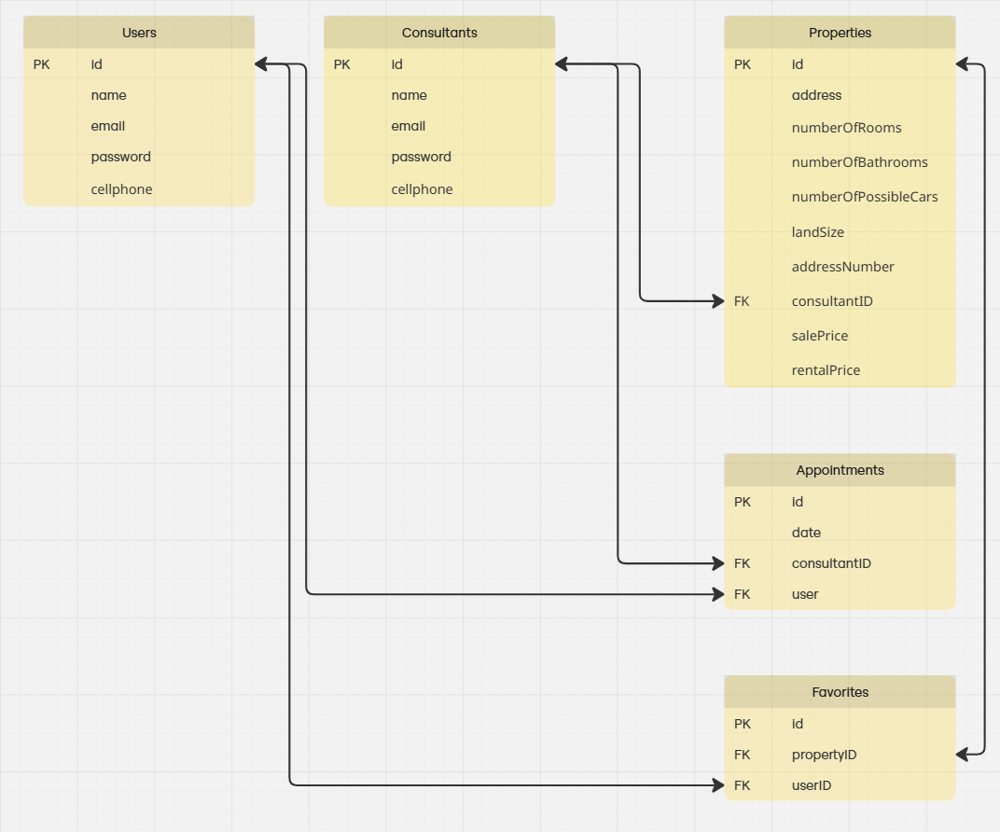
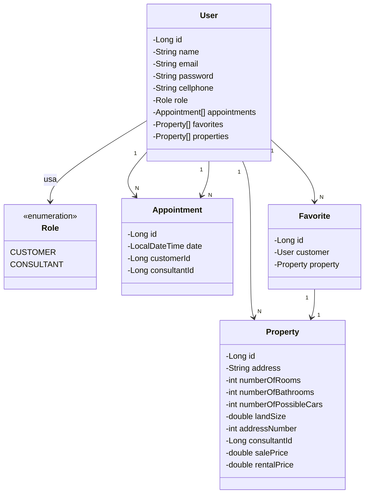

# 🏡 Imóveis SA - API REST com Spring Boot

Este projeto é uma reimplementação de um sistema fictício desenvolvido anteriormente com colegas, agora utilizando Java e Spring Boot com foco em boas práticas de arquitetura, autenticação e persistência de dados. Trata-se de uma API REST para uma plataforma de anúncios de imóveis chamada **Imóveis SA**.

## 🔧 Tecnologias utilizadas

- Java 17+
- Spring Boot
- JPA + Hibernate
- PostgreSQL em Container Docker
### Em breve
- Spring Security + JWT
### Em breve
- JUnit (testes unitários)

## 🧩 Funcionalidades

- Cadastro, edição e remoção de imóveis
- Listagem pública de imóveis
- Funcionalidade de favoritos
- Agendamento de visitas
### Em breve
- Cadastro de usuários com senha criptografada
### Em breve
- Login e autenticação com JWT
### Em breve
- Sistema de permissões (consultores/admins têm acesso a rotas restritas)

## 🎯 Objetivo

A proposta deste projeto é consolidar conhecimentos em desenvolvimento back-end com Java, modelagem de banco de dados relacional e autenticação segura com Spring Security, além de servir como material de estudo e portfólio.

## Modelagem do Banco de Dados

## Diagrama de Classes

