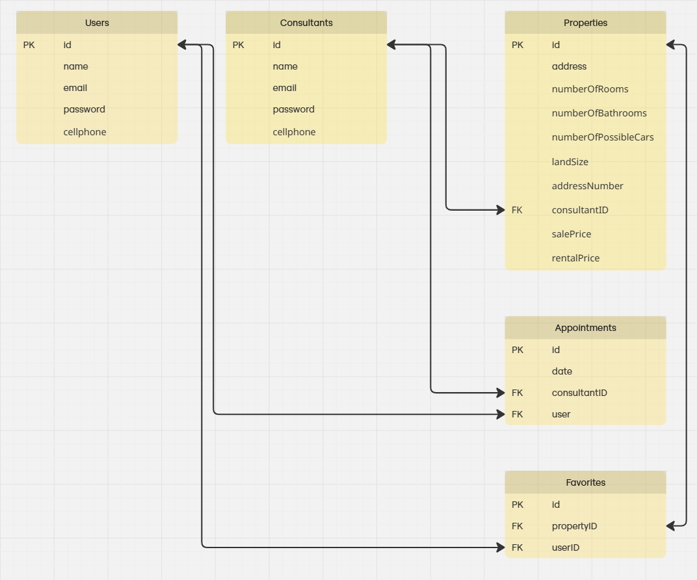
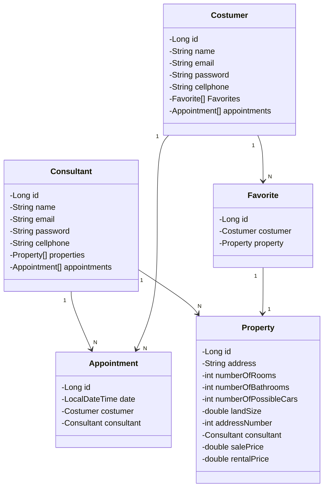

# 🏡 Imóveis SA - API REST com Spring Boot

Este projeto é uma reimplementação de um sistema fictício desenvolvido anteriormente com colegas, agora utilizando Java e Spring Boot com foco em boas práticas de arquitetura, autenticação e persistência de dados. Trata-se de uma API REST para uma plataforma de anúncios de imóveis chamada **Imóveis SA**.

## 🔧 Tecnologias utilizadas

- Java 17+
- Spring Boot
- JPA + Hibernate
- PostgreSQL em Container Docker
- Spring Security + JWT
- JUnit (testes unitários)

## 🧩 Funcionalidades

- Cadastro, edição e remoção de imóveis
- Listagem pública de imóveis
- Cadastro de usuários
- Login e autenticação com JWT
- Sistema de permissões (consultores/admins têm acesso a rotas restritas)
- Funcionalidade de favoritos
- Agendamento de visitas

## 🎯 Objetivo

A proposta deste projeto é consolidar conhecimentos em desenvolvimento back-end com Java, modelagem de banco de dados relacional e autenticação segura com Spring Security, além de servir como material de estudo e portfólio.

## Modelagem do Banco de Dados

## Diagrama de Classes

```mermaid
classDiagram
    class Costumer {
        -Long id
        -String name
        -String email
        -String password
        -String cellphone
        -Favorite[] Favorites
        -Appointment[] appointments
    }

    class Consultant {
        -Long id
        -String name
        -String email
        -String password
        -String cellphone
        -Property[] properties
        -Appointment[] appointments
    }

    class Property {
        -Long id
        -String address
        -int numberOfRooms
        -int numberOfBathrooms
        -int numberOfPossibleCars
        -double landSize
        -int addressNumber
        -Consultant consultant
        -double salePrice
        -double rentalPrice
    }

    class Appointment {
        -Long id
        -LocalDateTime date
        -Costumer costumer
        -Consultant consultant
    }

    class Favorite {
        -Long id
        -Costumer costumer
        -Property property
    }

    Consultant "1" --> "N" Property
    Consultant "1" --> "N" Appointment
    Costumer "1" --> "N" Appointment
    Costumer "1" --> "N" Favorite
    Favorite "1" --> "1" Property
```
